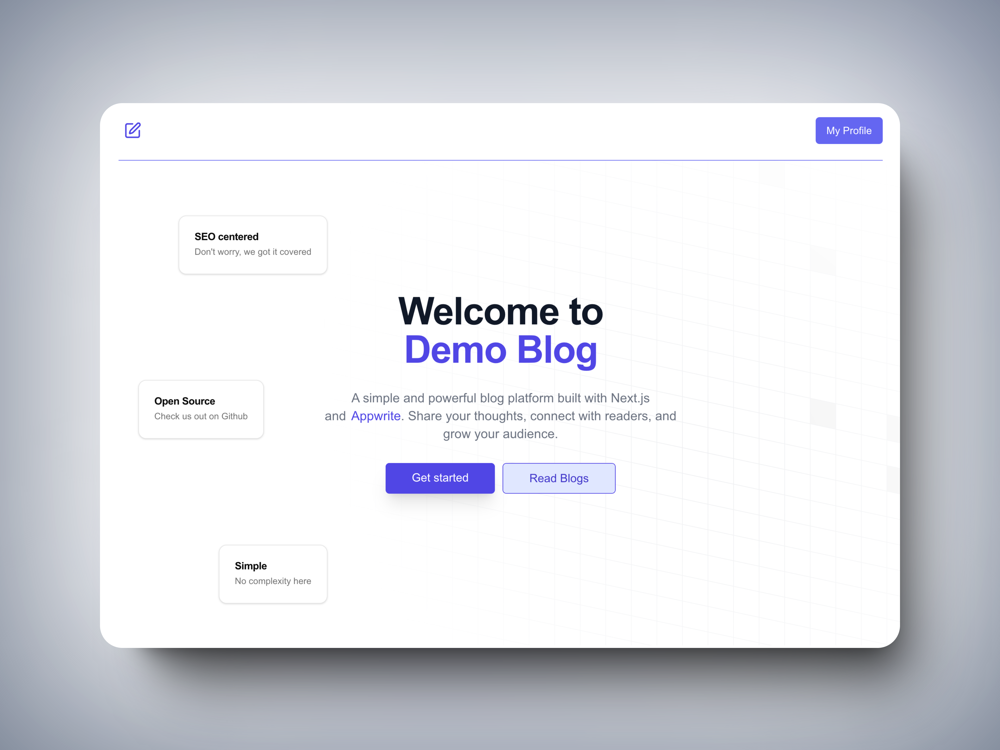

Demo Blog website built with Next.js and Appwrite.

## Getting Started

1. Clone the repository

```
git clone https://github.com/ChiragAgg5k/demo-blog-appwrite-nextjs
cd demo-blog-appwrite-nextjs
```

2. Install dependencies

```
pnpm install
```

You can also use `npm` or `yarn` instead of `pnpm`.

3. Create a `.env.local` file in the root directory and add the following environment variables:

```
NEXT_PUBLIC_APPWRITE_PROJECT_ID=<your-appwrite-project-id>
```

More information on how to setup Appwrite can be found in the [docs](./docs/appwrite.md).

4. Run the development server

```
pnpm dev
```

Additionally, you can change some settings in [constants.ts](./src/lib/constants.ts) to customize the blog.

---

Made with ❤️ by [Chirag Aggarwal](https://www.chiragaggarwal.tech/).
