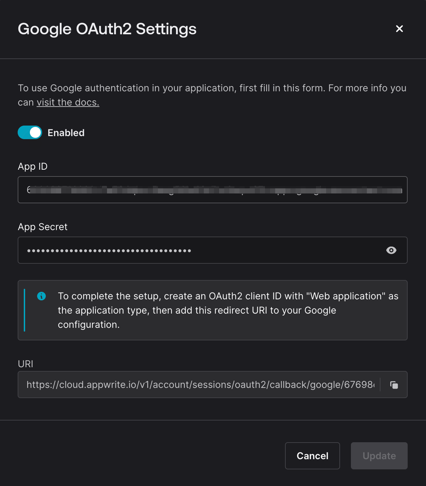

# Setting up Appwrite

Appwrite is a open source Backend as a Service (BaaS) platform. It mainly offers 6 services: Authentication, Database, Storage, Functions, Realtime and Messaging. This guide will help you set up Appwrite using their cloud service, as well as their self-hosted solution.

## Cloud Service

### Sign up

Go to [Appwrite](https://appwrite.io/) and sign up for a free account.

### Create a project

1. Once you've signed up, you'll be redirected to the console.
2. Select an organization or create a new one.
3. Click on the "Create Project" button, give your project a name and click on "Create".

Note down your project ID to be used as `NEXT_PUBLIC_APPWRITE_PROJECT_ID` in the `.env` file.


### Using Appwrite.json

All the settings required in the cloud configuration are present in the `appwrite.json` file. Firstly, download appwrite cli from [here](https://appwrite.io/docs/tooling/command-line/installation).

To push the settings to the cloud, run the following command:

```bash
appwrite login
appwrite init # select the existing project you created
appwrite push
```

### Setting your project with Appwrite.json

If somehow there is an error in the `appwrite.json` file, you can manually set up your project by following the steps below:

1. Once your project is created, you'll be redirected to the project dashboard.
2. Go to the Authentication section and switch to the Settings tab.
3. Enable `Google` OAuth2 provider. Add your Google Client ID and Client Secret.
   

4. Go to the Database section and click on "Create Database". For database id, use `demo-blog-appwrite-nextjs`.
5. Now create a collection called `blogs`. For collection id, use `blogs`.
   In this collection, create the following attributes:
   | Attribute Key | Type | Size | Required |
   | -------------- | ---- | ---- | -------- |
   | title | string | 120 | true |
   | content | string | 65535 | false |
   | author_id | string | 36 | true |
6. Switch to the settings section of your collection.
   1. Enable all permissions for users to create, read, update and delete in collection (as we have document level permissions enabled).
   2. Enable document level permissions.
      
